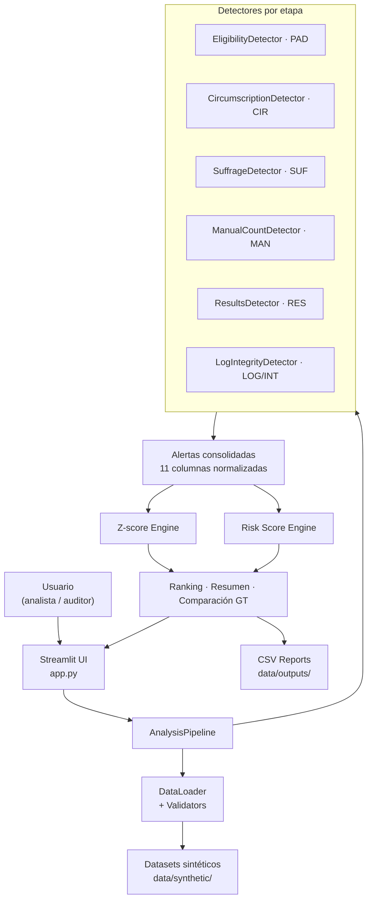
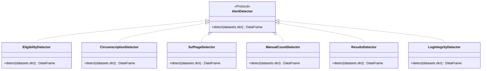

# Electoral Integrity Analyzer

Analizador de Integridad Electoral por Etapas — aplicación académica en Python + Streamlit para detectar anomalías en un proceso electoral simulado, organizada por etapas y con exportación de reportes.

> **Advertencia ética:** Este sistema utiliza datos sintéticos generados con fines académicos. Las alertas no constituyen prueba de fraude electoral. Los resultados deben interpretarse como señales de revisión que requieren validación documental, técnica y contextual. No se usan datos personales reales ni se analizan procesos electorales reales.

---

## Arquitectura

Monolito modular por capas con separación SOLID. La UI depende únicamente del pipeline; los detectores son intercambiables sin modificar las capas superiores.



### Capas y responsabilidades

| Capa | Módulo | Responsabilidad |
|------|--------|----------------|
| Presentación | `app.py` | Navegación, estado de sesión, renderizado |
| Carga | `src/data_loader/` | Lectura de CSV y validación de esquemas |
| Dominio | `src/domain/` | Catálogo de 24 códigos de alerta y esquemas |
| Detección | `src/detectors/` | Reglas por etapa electoral |
| Analítica | `src/analytics/` | Z-score, score de riesgo, resumen de hallazgos |
| Orquestación | `src/pipeline/` | Ejecución secuencial y consolidación de resultados |
| Visualización | `src/visualizations/` | 5 gráficos Plotly obligatorios |
| Exportación | `src/reports/` | Generación de 3 CSV de salida |
| Datos | `scripts/` | Generación reproducible de datasets sintéticos |

---

## Patrones de software

### Strategy + Protocol (detectores)

Cada detector implementa el protocolo `AlertDetector` con un único método `detect(datasets) -> DataFrame`. La interfaz es estructural (duck typing vía `typing.Protocol`), por lo que agregar un detector nuevo no requiere modificar ningún módulo existente.



### Factory Method

`build_default_detectors()` en `src/detectors/factory.py` devuelve la lista completa de detectores en orden de pipeline. El pipeline no sabe qué detectores existen; sólo los recibe e itera.

### Pipeline / Chain of Responsibility

`AnalysisPipeline.run()` aplica los detectores en secuencia, agrega sus DataFrames de alertas y los pasa por las etapas de analítica. Cada etapa recibe el resultado de la anterior.

### Repository (Data Access Object)

`load_datasets()` en `src/data_loader/csv_loader.py` centraliza el acceso a disco. El resto del sistema trabaja con diccionarios de DataFrames y no conoce rutas ni formatos.

### Catalog (Domain-Driven Design)

`ALERT_CATALOG` en `src/domain/alert_types.py` define los 24 códigos de alerta con severidad, descripción y acción recomendada como datos de configuración inmutables. Los detectores referencian el catálogo en lugar de hardcodear metadatos.

### Builder

`build_required_charts()` en `src/visualizations/charts.py` construye los 5 gráficos Plotly a través de funciones especializadas y los devuelve en un dict con clave fija, desacoplando la construcción del renderizado.

### Principios SOLID aplicados

| Principio | Aplicación concreta |
|-----------|-------------------|
| SRP | Cada módulo tiene una única responsabilidad (carga, detección, analítica, etc.) |
| OCP | Nuevos detectores se agregan implementando el protocolo, sin tocar los existentes |
| LSP | Cualquier detector puede sustituirse por otro sin cambiar `AnalysisPipeline` |
| ISP | El contrato del detector expone sólo `detect()` |
| DIP | `app.py` depende de `AnalysisPipeline`, no de detectores concretos |

---

## Patrones de detección de anomalías

### Reglas determinísticas

Verificaciones lógicas directas contra condiciones de negocio conocidas. Se aplican cuando la anomalía es inequívoca sin contexto estadístico.

**Ejemplos:**
- Persona fallecida con voto registrado (`PAD-01`)
- Participación > 100% en una mesa (`RES-02`)
- Usuario ejecuta acción fuera de su rol RBAC (`LOG-02`)
- Hash del archivo modificado post-cierre (`INT-01`)

### Detección de outliers con Z-score

Para variables continuas donde la anomalía es relativa al comportamiento del conjunto. Umbral: `|z| ≥ 3`.

```
z = (valor - μ) / σ
```

Se aplica sobre: porcentaje de participación por mesa, tasa de votos nulos/inválidos, concentración de registros por operador, tasa de invalidación por clasificador.

### Score de riesgo por entidad

Cada alerta aporta puntos según severidad. El score acumulado por mesa o entidad determina su posición en el ranking de revisión prioritaria.

```
score = Σ (crítica × 3) + (alta × 2) + (media × 1)
```

| Rango | Clasificación |
|-------|--------------|
| 0 | Sin alerta |
| 1 – 3 | Riesgo bajo |
| 4 – 7 | Riesgo medio |
| 8 – 12 | Riesgo alto |
| > 12 | Revisión prioritaria |

### Evaluación contra ground truth

Las alertas detectadas se comparan contra `08_alertas_esperadas.csv` por clave `(codigo_alerta, entidad_tipo, entidad_id)` para calcular precisión y cobertura aproximadas.

---

## Datasets sintéticos

Generados con `RANDOM_SEED = 42` para reproducibilidad. Incluyen anomalías inyectadas deliberadamente.

| Archivo | Contenido |
|---------|-----------|
| `01_padron_votantes.csv` | Padrón con registros de fallecidos, menores y documentos inválidos |
| `02_asignacion_mesas.csv` | Asignación de votantes a mesas y circunscripciones |
| `03_registro_sufragio.csv` | Check-ins con casos de doble voto y fuera de horario |
| `04_clasificacion_votos_manual.csv` | Clasificación manual con errores inyectados |
| `05_resultados_mesa.csv` | Resultados por mesa con inconsistencias matemáticas |
| `06_logs_eventos.csv` | Eventos del sistema con violaciones de control de acceso |
| `07_integridad_archivos.csv` | Hashes de archivos con modificaciones post-cierre |
| `08_alertas_esperadas.csv` | Ground truth para evaluación del sistema |
| `usuarios_sistema.csv` | Usuarios con roles y permisos |

---

## Instalación y ejecución

```bash
python -m venv .venv
source .venv/bin/activate          # Windows: .venv\Scripts\activate
pip install -r requirements.txt

python scripts/generate_synthetic_data.py   # genera los 9 datasets
streamlit run app.py
```

---

## Pruebas

```bash
pytest -q                                               # suite completa
pytest -q tests/test_detectors.py                      # sólo detectores
pytest -q tests/test_risk_score.py                     # sólo scoring
```

Para cualquier cambio en detectores se requieren tres tests: contrato de columnas, ejecución sin excepción y al menos una aserción de detección positiva.

---

## Limitaciones

- Dataset completamente sintético — no representa ningún proceso electoral real.
- Dos técnicas de detección únicamente: reglas determinísticas y Z-score. Sin ML ni clustering.
- No es un sistema productivo ni reemplaza una auditoría electoral formal.

---

## Tecnologías

Python 3.11+ · Streamlit · pandas · NumPy · SciPy · Plotly · Faker · pytest

---

## Referencias

### Estándares electorales (NIST / EAC)
1. [NIST Common Data Formats (CDF)](https://nvlpubs.nist.gov/nistpubs/gcr/2024/24-058/NIST.GCR.24-058.html)
2. [NIST Voter Records Interchange (VRI)](https://pages.nist.gov/VoterRecordsInterchange/)
3. [NIST Cast Vote Records (CVR)](https://pages.nist.gov/CastVoteRecords/)
4. [NIST Election Event Logging (EEL)](https://pages.nist.gov/ElectionEventLogging/)
5. [NIST Election Results Reporting (ERR)](https://github.com/usnistgov/ElectionResultsReporting)
6. [EAC Post-Election Tabulation Audit Guide](https://www.eac.gov/sites/default/files/2024-11/Post_Election_Tabulation_Audit_Guide_508.pdf)

### Seguridad y desarrollo seguro
7. [NIST Secure Software Development Framework (SSDF SP 800-218)](https://csrc.nist.gov/pubs/sp/800/218/final)

### Detección estadística
8. [SciPy — scipy.stats.zscore](https://docs.scipy.org/doc/scipy/reference/generated/scipy.stats.zscore.html)
9. [pandas — read_csv](https://pandas.pydata.org/docs/reference/api/pandas.read_csv.html)

### UX y accesibilidad
10. [Nielsen Norman Group — 10 Usability Heuristics](https://www.nngroup.com/articles/ten-usability-heuristics/)
11. [Nielsen Norman Group — Progressive Disclosure](https://www.nngroup.com/articles/progressive-disclosure/)
12. [WCAG 2.2](https://www.w3.org/TR/WCAG22/)
13. [W3C WAI — Accessibility Principles](https://www.w3.org/WAI/fundamentals/accessibility-principles/)

### Framework
14. [Streamlit Docs](https://docs.streamlit.io/)
