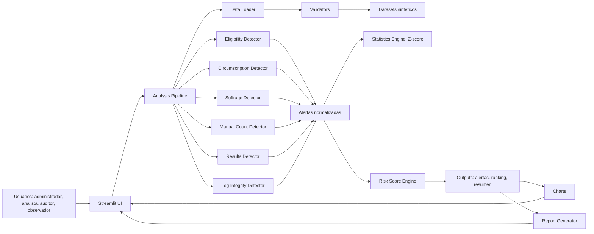

# Arquitectura

## Tipo
Monolito modular por capas orientado a demo académica.

## Capas y responsabilidades
- **Presentación**: `app.py` (Streamlit, navegación, interacción).
- **Carga y validación**: `src/data_loader`.
- **Dominio**: `src/domain` (esquemas, catálogo de alertas).
- **Detectores**: `src/detectors` por etapa electoral.
- **Analítica**: `src/analytics` (Z-score, score de riesgo, resumen).
- **Pipeline**: `src/pipeline/analysis_pipeline.py`.
- **Visualización**: `src/visualizations/charts.py`.
- **Reportes**: `src/reports/report_generator.py`.
- **Datos sintéticos**: `scripts/generate_synthetic_data.py`.

## SOLID aplicado
- SRP: un módulo, una responsabilidad principal.
- OCP: nuevos detectores se agregan sin modificar los existentes.
- LSP: todos los detectores cumplen `detect(datasets) -> DataFrame`.
- ISP: contrato mínimo (`detect`).
- DIP: UI depende del pipeline, no de lógica interna de cada detector.

## Diagrama Mermaid

