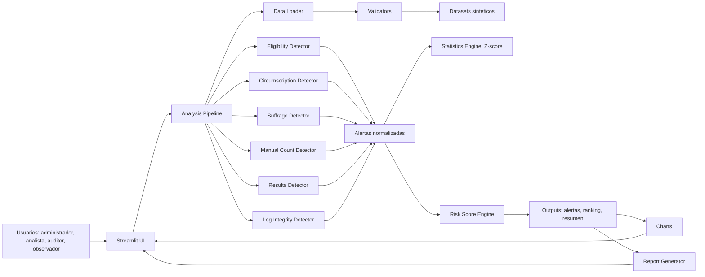

# Súper Guía Técnica para Codex  
## Electoral Integrity Analyzer — Analizador de Integridad Electoral por Etapas

**Fecha de generación:** 2026-05-06  
**Tipo de documento:** Especificación técnica completa para implementación con Codex  
**Alcance:** arquitectura, SOLID, datasets sintéticos, detección de anomalías, UI/UX, pruebas, documentación, criterios de aceptación y cumplimiento del curso.

> Esta guía reemplaza versiones parciales anteriores. Debe usarse como documento único de implementación.

---

## Proyecto: Electoral Integrity Analyzer  
### Analizador de Integridad Electoral por Etapas

**Versión:** 1.0  
**Fecha de referencia:** 2026-05-06  
**Propósito:** Esta guía define con precisión el sistema que debe implementar Codex para el proyecto final de la materia de ciberseguridad. No debe quedar ambigüedad sobre arquitectura, lenguaje, datasets, módulos, reglas, métricas, visualizaciones, pruebas, responsabilidades SOLID y criterios de aceptación.

---

# 1. Confirmación de cumplimiento del curso

## 1.1 Enunciado del curso

El curso solicita desarrollar una solución para identificar posibles anomalías en un proceso electoral simulado. El objetivo no es detectar fraude real, sino analizar datos y encontrar comportamientos inusuales que podrían indicar inconsistencias.

## 1.2 Cumplimiento del alcance

| Requisito del curso | Decisión del proyecto | Cumple |
|---|---|---|
| Dataset simulado | Se generarán datasets sintéticos propios con Python. | Sí |
| Puede ser creado o adaptado | Será creado por nosotros, inspirado en estructuras electorales del NIST. | Sí |
| Máximo 2 técnicas de detección | Se usarán solo reglas simples y estadística Z-score. | Sí |
| 3 a 5 visualizaciones | Se implementarán exactamente 5 visualizaciones. | Sí |
| Explicar claramente hallazgos | Cada alerta tendrá descripción, evidencia, severidad y acción recomendada. | Sí |
| No deep learning | No se usará deep learning. | Sí |
| No sistema en producción | Será una app local académica en Streamlit. | Sí |
| No interfaz web avanzada | Streamlit con menú lateral y dashboard sencillo. | Sí |
| Video máximo 8 min | La app será demostrable en un flujo corto por módulos. | Sí |
| Informe PDF | La guía deja estructura para contexto, metodología, resultados, visualizaciones y conclusiones. | Sí |
| Solo datos simulados | No se usarán datos personales ni datos electorales reales como base del análisis. | Sí |
| No afirmar fraude real | La app mostrará advertencia ética y hablará de anomalías, no de fraude probado. | Sí |

## 1.3 Conclusión de cumplimiento

El proyecto cumple el enunciado del curso porque desarrolla una solución de análisis de datos sobre un proceso electoral simulado, implementa máximo dos técnicas de detección, genera visualizaciones y explica hallazgos sin afirmar fraude real.

La aplicación será un prototipo académico de análisis de anomalías electorales por etapas, no un sistema de producción ni una herramienta oficial de auditoría electoral.

---

# 2. Fuentes técnicas que sustentan las decisiones

Estas fuentes no deben descargarse obligatoriamente en la app. Sirven como fundamento conceptual y documental.

## 2.1 NIST Common Data Formats

NIST tiene especificaciones y repositorios asociados a formatos comunes electorales, incluyendo:

- VRI: Voter Records Interchange.
- BD: Ballot Definition.
- CVR: Cast Vote Records.
- ERR: Election Results Reporting.
- EEL: Election Event Logging.

En el proyecto no implementaremos esos formatos completos en JSON/XML, porque sería excesivo para el alcance académico. Sin embargo, los usaremos como inspiración conceptual para estructurar nuestros CSV sintéticos por etapas.

Fuentes de referencia:

- NIST CDF Implementation Guide: https://nvlpubs.nist.gov/nistpubs/gcr/2024/24-058/NIST.GCR.24-058.html
- NIST Election Results Reporting GitHub: https://github.com/usnistgov/ElectionResultsReporting
- NIST Election Event Logging GitHub: https://github.com/usnistgov/ElectionEventLogging
- NIST Election Event Logging HTML: https://pages.nist.gov/ElectionEventLogging/
- NIST Ballot Definition GitHub: https://github.com/usnistgov/BallotDefinition
- NIST Cast Vote Records: https://pages.nist.gov/CastVoteRecords/

## 2.2 EAC Post-Election Tabulation Audit Guide

La EAC plantea la auditoría post-electoral como un proceso de revisión de evidencia frente a expectativas para detectar errores, inconsistencias o problemas. Esto justifica que nuestra app no declare fraude, sino que priorice revisión.

Fuente:

- EAC Post-Election Tabulation Audit Guide: https://www.eac.gov/sites/default/files/2024-11/Post_Election_Tabulation_Audit_Guide_508.pdf

## 2.3 NIST Secure Software Development Framework

NIST SSDF recomienda prácticas para reducir vulnerabilidades en software liberado. Para el proyecto, esto se traduce en separación de responsabilidades, pruebas, validaciones, control de dependencias y diseño seguro.

Fuente:

- NIST SP 800-218 SSDF: https://csrc.nist.gov/pubs/sp/800/218/final

## 2.4 Streamlit

Streamlit será usado porque permite crear aplicaciones de datos en Python sin construir frontend ni backend complejos.

Fuente:

- Streamlit Documentation: https://docs.streamlit.io/

## 2.5 pandas

pandas será usado para leer, transformar y analizar CSV mediante DataFrames.

Fuente:

- pandas.read_csv: https://pandas.pydata.org/docs/reference/api/pandas.read_csv.html

## 2.6 SciPy / Z-score

Se usará Z-score para detectar valores estadísticamente atípicos.

Fuente:

- SciPy zscore: https://docs.scipy.org/doc/scipy/reference/generated/scipy.stats.zscore.html

---

# 3. Nombre, objetivo y alcance del sistema

## 3.1 Nombre del repositorio

```text
electoral-integrity-analyzer
```

## 3.2 Nombre de la aplicación

```text
Electoral Integrity Analyzer
```

## 3.3 Nombre en español

```text
Analizador de Integridad Electoral por Etapas
```

## 3.4 Objetivo funcional

Construir una aplicación local en Python y Streamlit que:

1. Genere datasets electorales sintéticos.
2. Cargue los datasets generados.
3. Valide estructura, columnas y relaciones básicas.
4. Analice anomalías por etapa del proceso electoral.
5. Use reglas simples y Z-score como técnicas de detección.
6. Genere alertas explicadas.
7. Calcule score de riesgo.
8. Muestre visualizaciones.
9. Permita exportar resultados.
10. Mantenga advertencia ética visible.

## 3.5 Objetivo académico

Aplicar análisis de datos y conceptos de ciberseguridad para identificar patrones sospechosos o inconsistencias en un proceso electoral simulado.

## 3.6 Qué NO debe hacer el sistema

El sistema no debe:

- afirmar fraude electoral real;
- usar datos personales reales;
- analizar elecciones reales;
- usar deep learning;
- implementar sistemas de votación reales;
- conectarse a bases de datos productivas;
- tener autenticación real compleja;
- tener frontend avanzado;
- ser presentado como herramienta oficial de auditoría.

---

# 4. Tesis del proyecto

La tesis que debe mantenerse en README, app, informe y demo es:

> Se desarrolló una aplicación académica para analizar anomalías electorales por etapas mediante datasets sintéticos. El sistema aplica reglas simples y análisis estadístico para identificar comportamientos inusuales en padrón, registro de sufragio, circunscripción, escrutinio, resultados e integridad de logs. Las alertas generadas no prueban fraude electoral; funcionan como señales de revisión documental, estadística o técnica.

---

# 5. Arquitectura general

## 5.1 Tipo de arquitectura

La aplicación debe implementarse como:

```text
Monolito modular por capas
```

## 5.2 Justificación

Se elige monolito modular porque:

- el curso no exige sistema en producción;
- se requiere implementación rápida y demostrable;
- Streamlit permite interfaz sencilla en Python;
- se evita complejidad innecesaria de APIs, microservicios o frontend avanzado;
- se mantiene separación interna por responsabilidades.

## 5.3 Capas

La arquitectura tendrá estas capas:

1. Presentación.
2. Carga y validación de datos.
3. Dominio electoral.
4. Detección de anomalías.
5. Análisis estadístico.
6. Score de riesgo.
7. Visualización.
8. Reportes.
9. Pipeline de orquestación.
10. Generación de datasets.

## 5.4 Regla de separación

Ningún módulo debe hacer más de una responsabilidad principal.

Ejemplos:

- `app.py` muestra la interfaz, pero no detecta anomalías.
- Los detectores generan alertas, pero no leen CSV.
- `statistics.py` calcula Z-score, pero no decide por sí solo hallazgos finales.
- `charts.py` dibuja gráficos, pero no recalcula reglas.
- `generate_synthetic_data.py` genera datos, pero no ejecuta la app.

---

# 6. Estructura obligatoria del repositorio

Codex debe crear exactamente esta estructura:

```text
electoral-integrity-analyzer/
│
├── app.py
├── requirements.txt
├── README.md
│
├── data/
│   ├── synthetic/
│   │   ├── 01_padron_votantes.csv
│   │   ├── 02_asignacion_mesas.csv
│   │   ├── 03_registro_sufragio.csv
│   │   ├── 04_clasificacion_votos_manual.csv
│   │   ├── 05_resultados_mesa.csv
│   │   ├── 06_logs_eventos.csv
│   │   ├── 07_integridad_archivos.csv
│   │   ├── 08_alertas_esperadas.csv
│   │   └── usuarios_sistema.csv
│   │
│   └── outputs/
│       ├── alertas_detectadas.csv
│       ├── ranking_riesgo.csv
│       └── resumen_hallazgos.csv
│
├── scripts/
│   └── generate_synthetic_data.py
│
├── src/
│   ├── config/
│   │   └── rules_config.py
│   │
│   ├── data_loader/
│   │   ├── csv_loader.py
│   │   └── validators.py
│   │
│   ├── domain/
│   │   ├── schemas.py
│   │   └── alert_types.py
│   │
│   ├── detectors/
│   │   ├── base.py
│   │   ├── eligibility_detector.py
│   │   ├── circumscription_detector.py
│   │   ├── suffrage_detector.py
│   │   ├── manual_count_detector.py
│   │   ├── results_detector.py
│   │   └── log_integrity_detector.py
│   │
│   ├── analytics/
│   │   ├── statistics.py
│   │   ├── risk_score.py
│   │   └── summary.py
│   │
│   ├── pipeline/
│   │   └── analysis_pipeline.py
│   │
│   ├── visualizations/
│   │   └── charts.py
│   │
│   └── reports/
│       └── report_generator.py
│
├── tests/
│   ├── test_data_generation.py
│   ├── test_detectors.py
│   └── test_risk_score.py
│
└── docs/
    ├── arquitectura.md
    ├── metodologia.md
    ├── diccionario_datos.md
    └── guia_demo.md
```

---

# 7. Dependencias

## 7.1 Archivo `requirements.txt`

Debe contener:

```txt
streamlit
pandas
numpy
scipy
plotly
faker
pytest
```

No agregar dependencias innecesarias.

## 7.2 Dependencia opcional

No usar en versión inicial:

```txt
scikit-learn
```

Isolation Forest se deja fuera para cumplir el límite de máximo dos técnicas.

---

# 8. Comandos obligatorios de ejecución

El README debe incluir:

```bash
python -m venv .venv
source .venv/bin/activate
pip install -r requirements.txt
python scripts/generate_synthetic_data.py
streamlit run app.py
```

En Windows, puede agregarse:

```bash
.venv\Scripts\activate
```

---

# 9. Principios SOLID aplicados

## 9.1 Single Responsibility Principle

Cada módulo tiene una razón única de cambio:

| Módulo | Responsabilidad |
|---|---|
| `app.py` | Interfaz Streamlit. |
| `csv_loader.py` | Cargar CSV. |
| `validators.py` | Validar estructura y llaves. |
| `schemas.py` | Definir columnas esperadas. |
| `alert_types.py` | Definir catálogo de alertas. |
| `base.py` | Definir contrato común de detectores. |
| `eligibility_detector.py` | Detectar anomalías de elegibilidad. |
| `circumscription_detector.py` | Detectar mesa/circunscripción incorrecta. |
| `suffrage_detector.py` | Detectar anomalías de sufragio. |
| `manual_count_detector.py` | Detectar anomalías de clasificación manual. |
| `results_detector.py` | Detectar anomalías de resultados. |
| `log_integrity_detector.py` | Detectar anomalías de logs e integridad. |
| `statistics.py` | Calcular Z-score y porcentajes. |
| `risk_score.py` | Calcular score y rankings. |
| `summary.py` | Crear resúmenes. |
| `analysis_pipeline.py` | Orquestar detectores y consolidar resultados. |
| `charts.py` | Crear gráficos. |
| `report_generator.py` | Exportar archivos de salida. |
| `generate_synthetic_data.py` | Generar datasets sintéticos. |

## 9.2 Open/Closed Principle

Debe ser posible agregar un nuevo detector sin modificar los existentes. Para ello:

- todos los detectores implementan `detect()`;
- el pipeline recibe una lista de detectores;
- para agregar un detector nuevo, se crea una clase nueva y se registra en el pipeline.

## 9.3 Liskov Substitution Principle

Todos los detectores deben cumplir el mismo contrato:

```python
def detect(self, datasets: dict[str, pd.DataFrame]) -> pd.DataFrame:
    ...
```

Cualquier detector puede ser reemplazado por otro sin romper el pipeline.

## 9.4 Interface Segregation Principle

No crear una interfaz gigante. La interfaz de detector solo exige `detect()`.

No obligar a los detectores a implementar métodos que no usan.

## 9.5 Dependency Inversion Principle

`app.py` no debe depender de detalles internos de cada detector. Debe llamar al pipeline.

`analysis_pipeline.py` debe trabajar con detectores que cumplan el contrato común, no con lógica incrustada.

---

# 10. Contrato común de detectores

Crear archivo:

```text
src/detectors/base.py
```

Contenido mínimo:

```python
from typing import Protocol
import pandas as pd

class AlertDetector(Protocol):
    def detect(self, datasets: dict[str, pd.DataFrame]) -> pd.DataFrame:
        ...
```

Todos los detectores deben devolver un DataFrame con estas columnas exactas:

```text
alerta_id
codigo_alerta
severidad
etapa
entidad_tipo
entidad_id
dataset_origen
descripcion
evidencia
accion_recomendada
score
```

---

# 11. Dataset sintético: decisión definitiva

## 11.1 Decisión

El dataset principal será generado por nosotros.

No usar Kaggle para el MVP.

No descargar datos electorales reales.

No usar datos personales reales.

## 11.2 Script obligatorio

Crear:

```text
scripts/generate_synthetic_data.py
```

Ese script debe generar automáticamente todos los CSV en:

```text
data/synthetic/
```

## 11.3 Reproducibilidad

Usar semilla:

```python
RANDOM_SEED = 42
```

Todos los datasets deben poder regenerarse con los mismos resultados.

## 11.4 Tamaño base

Usar estos parámetros:

```python
NUM_VOTERS = 5000
NUM_MUNICIPALITIES = 5
NUM_ZONES = 10
NUM_POLLING_STATIONS = 25
NUM_TABLES = 80
NUM_USERS = 60
```

---

# 12. Configuración global

Crear:

```text
src/config/rules_config.py
```

Debe contener:

```python
RANDOM_SEED = 42

NUM_VOTERS = 5000
NUM_MUNICIPALITIES = 5
NUM_ZONES = 10
NUM_POLLING_STATIONS = 25
NUM_TABLES = 80
NUM_USERS = 60

ELECTION_DATE = "2026-06-03"
ELECTION_OPEN_TIME = "08:00:00"
ELECTION_CLOSE_TIME = "16:00:00"

MIN_VOTING_AGE = 18
MAX_REASONABLE_AGE = 115

HIGH_TURNOUT_THRESHOLD = 0.95
Z_SCORE_THRESHOLD = 3.0

CRITICAL_SCORE = 3
HIGH_SCORE = 2
MEDIUM_SCORE = 1
```

---

# 13. Datasets obligatorios

## 13.1 `01_padron_votantes.csv`

### Objetivo

Representar el padrón electoral simulado.

### Columnas obligatorias

```text
voter_id
documento_hash
fecha_nacimiento
edad
fecha_defuncion
estado_documento
condicion_legal
habilitado_legalmente
estado_padron
municipio
zona_id
circunscripcion_autorizada
mesa_asignada
```

### Valores permitidos

```text
estado_documento: vigente, cancelado, inconsistente
condicion_legal: normal, inhabilitado, privado_libertad, fallecido
habilitado_legalmente: 0, 1
estado_padron: activo, inactivo
```

### Anomalías inyectadas

```text
PAD-01: fallecido marcado como activo o con voto registrado
PAD-02: menor de edad habilitado o con voto registrado
PAD-03: edad imposible superior a 115
PAD-04: documento cancelado marcado como habilitado
PAD-05: persona inhabilitada marcada como habilitada
PAD-06: documento_hash duplicado
```

### Proporciones sugeridas

```text
2.0% fallecidos activos
1.5% menores habilitados
1.0% edad imposible
1.5% documentos cancelados habilitados
1.0% inhabilitados habilitados
0.5% documentos duplicados
```

---

## 13.2 `02_asignacion_mesas.csv`

### Objetivo

Representar mesa, puesto, zona y circunscripción autorizada para cada votante.

### Columnas obligatorias

```text
voter_id
mesa_asignada
puesto_asignado
zona_asignada
municipio_asignado
circunscripcion_autorizada
tipo_boleta_autorizada
puede_votar_en_otro_puesto
justificacion_excepcion
```

### Valores permitidos

```text
tipo_boleta_autorizada: nacional, municipal, especial
puede_votar_en_otro_puesto: 0, 1
```

### Anomalías inyectadas

```text
CIR-01: mesa asignada incompatible
CIR-02: circunscripción autorizada inconsistente
CIR-03: tipo de boleta incorrecto
```

### Proporciones sugeridas

```text
2.0% mesa incompatible
1.5% circunscripción inconsistente
1.0% tipo de boleta incorrecto
```

---

## 13.3 `03_registro_sufragio.csv`

### Objetivo

Representar el registro de sufragio durante la jornada.

### Columnas obligatorias

```text
suffrage_id
voter_id
fecha_eleccion
voto_registrado
mesa_voto
puesto_voto
zona_voto
municipio_voto
circunscripcion_voto
hora_checkin
metodo_checkin
operador_checkin
```

### Valores permitidos

```text
voto_registrado: 0, 1
metodo_checkin: manual, electronico
```

### Anomalías inyectadas

```text
SUF-01: doble sufragio
SUF-02: voto registrado por persona fallecida
SUF-03: voto registrado por menor de edad
SUF-04: voto registrado por inhabilitado
SUF-05: voto en mesa diferente a la asignada
SUF-06: voto en circunscripción prohibida
SUF-07: check-in fuera de horario
```

### Proporciones sugeridas

```text
70% participación normal de votantes habilitados
1.0% doble sufragio
2.0% voto de fallecido, inhabilitado o menor combinado
3.0% mesa o circunscripción incorrecta
2.0% check-in fuera de horario
```

---

## 13.4 `04_clasificacion_votos_manual.csv`

### Objetivo

Representar clasificación manual de votos.

### Columnas obligatorias

```text
ballot_id
mesa_id
voter_id
marca_simulada
clasificacion_objetiva
clasificacion_jurado
clasificacion_auditoria
usuario_clasificador
```

### Valores permitidos

```text
marca_simulada: candidato_A, candidato_B, candidato_C, blanco, marca_ambigua, multiple_marca, sin_marca
clasificacion_objetiva: valido, blanco, nulo, invalido
clasificacion_jurado: valido, blanco, nulo, invalido
clasificacion_auditoria: valido, blanco, nulo, invalido
```

### Distribución normal sugerida

```text
candidato_A: 40%
candidato_B: 35%
candidato_C: 15%
blanco: 5%
nulo/invalido: 5%
```

### Anomalías inyectadas

```text
MAN-01: voto objetivamente válido declarado inválido
MAN-02: voto objetivamente inválido declarado válido
MAN-03: voto blanco reclasificado indebidamente
MAN-04: usuario clasificador con tasa anormal de invalidación
```

---

## 13.5 `05_resultados_mesa.csv`

### Objetivo

Representar resultados agregados por mesa.

### Columnas obligatorias

```text
mesa_id
municipio
zona_id
circunscripcion
electores_habilitados
sufragantes_registrados
votos_candidato_A
votos_candidato_B
votos_candidato_C
votos_blancos
votos_nulos
votos_invalidos
total_calculado
total_reportado
participacion_pct
ganador
concentracion_ganador_pct
margen_victoria_pct
```

### Anomalías inyectadas

```text
RES-01: sufragantes_registrados > electores_habilitados
RES-02: participación superior al 100%
RES-03: total_reportado diferente al total_calculado
RES-04: participación estadísticamente atípica
RES-05: votos nulos o inválidos atípicos
RES-06: concentración extrema del ganador
```

---

## 13.6 `06_logs_eventos.csv`

### Objetivo

Representar eventos de ciberseguridad, acciones de usuarios y trazabilidad.

### Columnas obligatorias

```text
evento_id
timestamp
usuario_id
rol_usuario
accion
recurso
mesa_id
zona_id
resultado_accion
ip_origen
requiere_aprobacion
aprobado_por
hash_antes
hash_despues
```

### Roles permitidos

```text
ADMIN_ELECTORAL
OPERADOR_PADRON
JURADO_MESA
CLASIFICADOR_MANUAL
SUPERVISOR_ESCRUTINIO
OPERADOR_TECNICO
ANALISTA_SEGURIDAD
AUDITOR
SERVICIO_SISTEMA
```

### Acciones permitidas

```text
login
logout
crear_registro
actualizar_padron
registrar_checkin
clasificar_voto
cargar_resultado
modificar_resultado
aprobar_correccion
generar_hash
publicar_reporte
consultar_alertas
exportar_reporte
```

### Anomalías inyectadas

```text
LOG-01: modificación posterior al cierre sin aprobación
LOG-02: usuario ejecuta acción no permitida por su rol
LOG-03: usuario inactivo o no autorizado ejecuta acción
LOG-04: múltiples intentos fallidos de acceso
LOG-05: hash_antes diferente de hash_despues en acción no autorizada
LOG-06: usuario aprueba su propio cambio
```

---

## 13.7 `07_integridad_archivos.csv`

### Objetivo

Representar integridad de actas, reportes, snapshots y archivos publicados.

### Columnas obligatorias

```text
archivo_id
tipo_archivo
mesa_id
version
hash_original
hash_actual
timestamp_firma
timestamp_publicacion
usuario_publicador
estado_integridad
reporte_firmado_total
reporte_publicado_total
```

### Valores permitidos

```text
tipo_archivo: acta, resultado_mesa, snapshot_publicacion, log_exportado
estado_integridad: integro, alterado, pendiente_revision
```

### Anomalías inyectadas

```text
INT-01: hash_original diferente de hash_actual
INT-02: reporte_publicado_total diferente de reporte_firmado_total
INT-03: publicación antes de firma
INT-04: archivo alterado después de cierre
```

---

## 13.8 `08_alertas_esperadas.csv`

### Objetivo

Representar el ground truth sintético de anomalías inyectadas.

### Columnas obligatorias

```text
alerta_id
codigo_alerta
entidad_tipo
entidad_id
dataset_origen
severidad
descripcion
```

### Valores permitidos

```text
entidad_tipo: voter_id, mesa_id, ballot_id, usuario_id, archivo_id, evento_id
severidad: critica, alta, media
```

Este archivo se usa para evaluar si el sistema detectó las anomalías esperadas.

---

## 13.9 `usuarios_sistema.csv`

### Objetivo

Representar usuarios y permisos simulados.

### Columnas obligatorias

```text
usuario_id
nombre_usuario
rol
estado_usuario
zona_asignada
mesa_asignada
puede_modificar_padron
puede_registrar_sufragio
puede_clasificar_votos
puede_modificar_resultados
puede_aprobar_cambios
puede_ver_logs
requiere_mfa
```

### Distribución sugerida

```text
2 ADMIN_ELECTORAL
8 OPERADOR_PADRON
15 JURADO_MESA
10 CLASIFICADOR_MANUAL
5 SUPERVISOR_ESCRUTINIO
6 OPERADOR_TECNICO
4 ANALISTA_SEGURIDAD
5 AUDITOR
5 SERVICIO_SISTEMA
```

---

# 14. Generación de datasets paso a paso

`generate_synthetic_data.py` debe ejecutar estos pasos:

## Paso 1: Configurar semilla

```python
np.random.seed(RANDOM_SEED)
random.seed(RANDOM_SEED)
Faker.seed(RANDOM_SEED)
```

## Paso 2: Crear geografía electoral simulada

Crear:

```text
5 municipios
10 zonas
25 puestos
80 mesas
```

IDs sugeridos:

```text
MUN-01
ZONA-01
PUESTO-001
MESA-001
CIRC-01
```

## Paso 3: Crear usuarios del sistema

Generar 60 usuarios con roles, permisos y estado.

Estados:

```text
activo
inactivo
suspendido
```

## Paso 4: Crear padrón

Crear 5000 votantes con:

- ID;
- documento anonimizado;
- edad;
- fecha de nacimiento;
- condición legal;
- estado de documento;
- mesa asignada;
- circunscripción autorizada.

## Paso 5: Inyectar anomalías de padrón

Seleccionar subconjuntos reproducibles y alterar:

- fallecidos activos;
- menores habilitados;
- edades imposibles;
- documentos cancelados;
- duplicados;
- inhabilitados activos.

Cada anomalía debe registrarse en `08_alertas_esperadas.csv`.

## Paso 6: Crear asignación de mesas

Asignar a cada votante:

- mesa;
- puesto;
- zona;
- municipio;
- circunscripción;
- tipo de boleta.

## Paso 7: Crear registro de sufragio

Simular que aproximadamente 70% de los habilitados votan.

Luego inyectar:

- doble voto;
- fallecido con voto;
- menor con voto;
- inhabilitado con voto;
- mesa incorrecta;
- circunscripción prohibida;
- check-in fuera de horario.

## Paso 8: Crear clasificación de votos

Para cada sufragio válido, crear un ballot.

Clasificar normalmente y luego inyectar:

- válido declarado inválido;
- inválido declarado válido;
- blanco mal clasificado;
- clasificador con conducta anómala.

## Paso 9: Crear resultados por mesa

Agrupar clasificación por mesa.

Calcular:

- total por candidato;
- blancos;
- nulos;
- inválidos;
- total_calculado;
- total_reportado;
- participación;
- ganador;
- concentración del ganador;
- margen de victoria.

Luego inyectar inconsistencias.

## Paso 10: Crear logs

Generar eventos normales y anómalos.

Debe haber eventos para:

- login;
- check-in;
- clasificación;
- carga de resultados;
- modificación;
- aprobación;
- hash;
- publicación.

## Paso 11: Crear integridad de archivos

Crear registros de hash y versiones.

Inyectar:

- hash alterado;
- publicado distinto del firmado;
- publicación antes de firma.

## Paso 12: Guardar CSV

Guardar todos los archivos en `data/synthetic/`.

## Paso 13: Validación final

Al terminar, imprimir resumen:

```text
Datasets generados correctamente.
Total votantes: 5000
Total mesas: 80
Total usuarios: 60
Total alertas esperadas: X
Ubicación: data/synthetic/
```

---

# 15. Técnicas de detección

## 15.1 Técnica 1: reglas simples

Las reglas simples detectan inconsistencias determinísticas.

Ejemplos:

```text
fecha_defuncion < fecha_eleccion AND voto_registrado = 1
edad < 18 AND voto_registrado = 1
habilitado_legalmente = 0 AND voto_registrado = 1
mesa_voto != mesa_asignada
circunscripcion_voto != circunscripcion_autorizada
total_reportado != total_calculado
hash_original != hash_actual
timestamp_publicacion < timestamp_firma
```

## 15.2 Técnica 2: Z-score

El Z-score detecta valores atípicos en variables numéricas.

Aplicar a:

```text
participacion_pct
votos_nulos_pct
votos_invalidos_pct
concentracion_ganador_pct
margen_victoria_pct
eventos_por_usuario
modificaciones_por_mesa
```

Regla:

```text
si abs(z_score) >= 3.0, generar alerta estadística
```

No usar más técnicas para cumplir el límite del curso.

No usar clustering.

No usar Isolation Forest.

No usar deep learning.

---

# 16. Catálogo obligatorio de alertas

## 16.1 Elegibilidad

```text
PAD-01 | critica | Persona fallecida aparece con voto registrado
PAD-02 | critica | Menor de edad aparece con voto registrado
PAD-03 | alta | Edad imposible o superior a 115 años
PAD-04 | critica | Documento cancelado aparece con voto registrado
PAD-05 | critica | Persona legalmente inhabilitada aparece con voto registrado
PAD-06 | alta | Documento duplicado en el padrón
```

## 16.2 Circunscripción

```text
CIR-01 | alta | Voto registrado en mesa diferente a la asignada
CIR-02 | critica | Voto registrado en circunscripción no autorizada
CIR-03 | alta | Tipo de boleta no corresponde a la circunscripción
```

## 16.3 Sufragio

```text
SUF-01 | critica | Posible doble sufragio
SUF-02 | critica | Check-in de persona no habilitada
SUF-03 | alta | Check-in fuera del horario electoral
SUF-04 | alta | Operador con concentración anómala de registros
```

## 16.4 Escrutinio manual

```text
MAN-01 | alta | Voto válido declarado inválido
MAN-02 | alta | Voto inválido declarado válido
MAN-03 | media | Mesa con tasa atípica de votos inválidos
MAN-04 | alta | Clasificador con tasa anómala de invalidación
```

## 16.5 Resultados

```text
RES-01 | critica | Sufragantes registrados mayores que electores habilitados
RES-02 | critica | Participación superior al 100%
RES-03 | alta | Total reportado no coincide con total calculado
RES-04 | media | Participación estadísticamente atípica
RES-05 | media | Votos nulos o inválidos estadísticamente atípicos
RES-06 | media | Concentración extrema del ganador
```

## 16.6 Logs

```text
LOG-01 | critica | Modificación posterior al cierre sin aprobación
LOG-02 | critica | Acción no permitida por el rol del usuario
LOG-03 | alta | Usuario inactivo o no autorizado ejecuta una acción
LOG-04 | media | Intentos fallidos repetidos
LOG-05 | critica | Hash modificado en evento no autorizado
LOG-06 | critica | Usuario aprueba su propio cambio
```

## 16.7 Integridad

```text
INT-01 | critica | Hash original diferente del hash actual
INT-02 | critica | Reporte publicado diferente del reporte firmado
INT-03 | alta | Archivo publicado antes de ser firmado
INT-04 | alta | Archivo alterado después del cierre
```

---

# 17. Responsabilidades de cada detector

## 17.1 `EligibilityDetector`

### Usa

```text
01_padron_votantes.csv
03_registro_sufragio.csv
```

### Detecta

```text
PAD-01
PAD-02
PAD-03
PAD-04
PAD-05
PAD-06
```

### Prohibido

No detectar mesa incorrecta, logs, hashes, resultados por candidato ni clasificación manual.

---

## 17.2 `CircumscriptionDetector`

### Usa

```text
02_asignacion_mesas.csv
03_registro_sufragio.csv
```

### Detecta

```text
CIR-01
CIR-02
CIR-03
```

### Prohibido

No detectar fallecidos, menores, clasificación manual ni integridad de archivos.

---

## 17.3 `SuffrageDetector`

### Usa

```text
01_padron_votantes.csv
02_asignacion_mesas.csv
03_registro_sufragio.csv
usuarios_sistema.csv
```

### Detecta

```text
SUF-01
SUF-02
SUF-03
SUF-04
```

### Prohibido

No clasificar votos ni calcular resultados de mesa.

---

## 17.4 `ManualCountDetector`

### Usa

```text
04_clasificacion_votos_manual.csv
usuarios_sistema.csv
```

### Detecta

```text
MAN-01
MAN-02
MAN-03
MAN-04
```

### Prohibido

No analizar padrón, sufragio, logs ni hashes.

---

## 17.5 `ResultsDetector`

### Usa

```text
05_resultados_mesa.csv
```

### Detecta

```text
RES-01
RES-02
RES-03
RES-04
RES-05
RES-06
```

### Prohibido

No leer logs, usuarios, padrón ni clasificación manual.

---

## 17.6 `LogIntegrityDetector`

### Usa

```text
06_logs_eventos.csv
07_integridad_archivos.csv
usuarios_sistema.csv
```

### Detecta

```text
LOG-01
LOG-02
LOG-03
LOG-04
LOG-05
LOG-06
INT-01
INT-02
INT-03
INT-04
```

### Prohibido

No calcular participación ni reclasificar votos.

---

# 18. Pipeline de análisis

Crear:

```text
src/pipeline/analysis_pipeline.py
```

## 18.1 Responsabilidad

Orquestar el análisis completo.

## 18.2 Debe hacer

1. Recibir datasets ya cargados.
2. Ejecutar detectores.
3. Concatenar alertas.
4. Calcular score.
5. Generar ranking.
6. Retornar resultados listos para la UI.

## 18.3 No debe hacer

- No debe cargar CSV.
- No debe crear reglas.
- No debe graficar.
- No debe generar datasets.

## 18.4 Estructura sugerida

```python
class AnalysisPipeline:
    def __init__(self, detectors):
        self.detectors = detectors

    def run(self, datasets):
        all_alerts = []
        for detector in self.detectors:
            alerts = detector.detect(datasets)
            all_alerts.append(alerts)

        consolidated_alerts = pd.concat(all_alerts, ignore_index=True)
        ranking = generate_risk_ranking(consolidated_alerts)
        summary = build_summary(consolidated_alerts, ranking)

        return {
            "alerts": consolidated_alerts,
            "ranking": ranking,
            "summary": summary,
        }
```

---

# 19. Score de riesgo

## 19.1 Puntajes

```text
critica = 3
alta = 2
media = 1
```

## 19.2 Clasificación

```text
0      = Sin alerta
1 a 3  = Riesgo bajo
4 a 7  = Riesgo medio
8 a 12 = Riesgo alto
> 12   = Revisión prioritaria
```

## 19.3 Ranking

Generar ranking para:

```text
mesa_id
voter_id
usuario_id
archivo_id
evento_id
```

## 19.4 Salidas

Guardar:

```text
data/outputs/alertas_detectadas.csv
data/outputs/ranking_riesgo.csv
data/outputs/resumen_hallazgos.csv
```

---

# 20. Evaluación del sistema

## 20.1 Ground truth

Usar:

```text
08_alertas_esperadas.csv
```

## 20.2 Comparación

Comparar alertas detectadas contra alertas esperadas por:

```text
codigo_alerta
entidad_tipo
entidad_id
```

## 20.3 Métricas

Calcular:

```text
alertas_esperadas
alertas_detectadas
coincidencias
precision_aproximada
cobertura_aproximada
```

## 20.4 Fórmulas

```text
precision_aproximada = coincidencias / alertas_detectadas
cobertura_aproximada = coincidencias / alertas_esperadas
```

Si el denominador es 0, devolver 0 y evitar división por cero.

---

# 21. Visualizaciones obligatorias

Implementar exactamente 5 visualizaciones.

## 21.1 Alertas por etapa

Tipo:

```text
Bar chart
```

Datos:

```text
alerts.groupby("etapa").size()
```

## 21.2 Alertas por severidad

Tipo:

```text
Bar chart o pie chart
```

Datos:

```text
alerts.groupby("severidad").size()
```

## 21.3 Histograma de participación

Dataset:

```text
05_resultados_mesa.csv
```

Variable:

```text
participacion_pct
```

## 21.4 Boxplot de votos nulos e inválidos

Variables calculadas:

```text
votos_nulos_pct = votos_nulos / total_reportado
votos_invalidos_pct = votos_invalidos / total_reportado
```

## 21.5 Ranking de riesgo por mesa

Tipo:

```text
Bar chart horizontal
```

Datos:

```text
Top 10 mesas por score_total
```

---

# 22. App Streamlit

## 22.1 Sidebar obligatorio

Debe tener estas secciones:

```text
Inicio
Cargar / generar datasets
Padrón y elegibilidad
Circunscripción y mesa
Registro de sufragio
Escrutinio manual
Resultados por mesa
Logs e integridad
Reporte consolidado
```

## 22.2 Inicio

Debe mostrar:

- nombre del sistema;
- objetivo;
- advertencia ética;
- datasets disponibles;
- total alertas;
- alertas críticas;
- score general;
- explicación de que no se afirma fraude.

## 22.3 Cargar / generar datasets

Debe permitir:

- generar datasets sintéticos;
- cargar datasets existentes desde `data/synthetic/`;
- validar esquemas;
- mostrar vista previa;
- mostrar errores de validación.

## 22.4 Módulos de análisis

Cada sección debe mostrar:

- dataset usado;
- reglas aplicadas;
- tabla de alertas;
- conteo por severidad;
- explicación de hallazgos;
- acción recomendada.

## 22.5 Reporte consolidado

Debe mostrar:

- tabla consolidada de alertas;
- ranking de riesgo;
- visualizaciones;
- resumen de evaluación;
- descargas CSV;
- conclusiones y limitaciones.

---

# 23. Advertencia ética obligatoria

La app, README, informe y reporte deben incluir:

```text
Este sistema utiliza datos sintéticos generados con fines académicos. Las alertas no constituyen prueba de fraude electoral. Los resultados deben interpretarse como señales de revisión que requieren validación documental, técnica y contextual.
```

También incluir:

```text
No se usan datos personales reales.
No se analizan procesos electorales reales.
No se atribuyen irregularidades a personas, partidos, países o instituciones reales.
```

---

# 24. Validadores obligatorios

`validators.py` debe validar:

1. Existencia de archivos.
2. Columnas obligatorias.
3. IDs no nulos.
4. Fechas válidas.
5. Valores categóricos permitidos.
6. Llaves referenciales.
7. Tipos numéricos.
8. Porcentajes calculables.

## 24.1 Llaves referenciales

Validar:

```text
registro_sufragio.voter_id existe en padron_votantes.voter_id
asignacion_mesas.voter_id existe en padron_votantes.voter_id
clasificacion_votos_manual.voter_id existe en padron_votantes.voter_id
resultados_mesa.mesa_id existe en asignacion_mesas.mesa_asignada
logs_eventos.usuario_id existe en usuarios_sistema.usuario_id
integridad_archivos.usuario_publicador existe en usuarios_sistema.usuario_id
```

---

# 25. Reportes y exportación

`report_generator.py` debe exportar:

```text
data/outputs/alertas_detectadas.csv
data/outputs/ranking_riesgo.csv
data/outputs/resumen_hallazgos.csv
```

El sistema no necesita generar PDF automáticamente. El PDF final puede construirse después con base en los resultados, visualizaciones y conclusiones.

---

# 26. Tests mínimos

Usar `pytest`.

## 26.1 `test_data_generation.py`

Debe validar:

- existen los CSV esperados;
- cada CSV tiene filas;
- columnas obligatorias presentes;
- `08_alertas_esperadas.csv` contiene alertas.

## 26.2 `test_detectors.py`

Debe validar:

- cada detector devuelve DataFrame;
- cada DataFrame tiene columnas estándar;
- al menos una anomalía inyectada se detecta;
- no hay excepción al ejecutar el pipeline.

## 26.3 `test_risk_score.py`

Debe validar:

- critica = 3;
- alta = 2;
- media = 1;
- score total por entidad;
- clasificación de riesgo.

---

# 27. README obligatorio

El README debe incluir:

1. Nombre del proyecto.
2. Objetivo.
3. Advertencia ética.
4. Tecnologías.
5. Arquitectura.
6. Estructura de carpetas.
7. Instalación.
8. Generación de datasets.
9. Ejecución de la app.
10. Técnicas de detección.
11. Datasets generados.
12. Visualizaciones.
13. Limitaciones.
14. Cómo correr tests.

---

# 28. Documentos en `docs/`

## 28.1 `arquitectura.md`

Debe incluir:

- arquitectura monolítica modular;
- diagrama Mermaid;
- capas;
- responsabilidades;
- SOLID.

## 28.2 `metodologia.md`

Debe incluir:

- contexto del proyecto;
- uso de datos sintéticos;
- reglas simples;
- Z-score;
- score de riesgo;
- evaluación;
- limitaciones.

## 28.3 `diccionario_datos.md`

Debe incluir:

- cada CSV;
- descripción;
- columnas;
- tipos;
- valores permitidos;
- anomalías relacionadas.

## 28.4 `guia_demo.md`

Debe incluir:

- pasos para generar datos;
- ejecutar app;
- mostrar módulos;
- explicar hallazgos;
- cerrar con limitaciones éticas.

---

# 29. Diagrama Mermaid de arquitectura

Incluir en `docs/arquitectura.md`:



---

# 30. Prompt final para Codex

Copiar y pegar en Codex:

```text
Implementa el proyecto electoral-integrity-analyzer exactamente según esta guía.

Crea una aplicación académica en Python y Streamlit para detectar anomalías en procesos electorales simulados. El sistema no debe usar datos reales ni afirmar fraude electoral. Debe generar sus propios datasets sintéticos reproducibles con RANDOM_SEED = 42.

Usa arquitectura monolítica modular por capas, con separación SOLID de responsabilidades.

Crea la estructura de carpetas y archivos definida en la guía.

Implementa:
- scripts/generate_synthetic_data.py para generar todos los CSV sintéticos.
- app.py como interfaz Streamlit.
- src/detectors/base.py con un Protocol AlertDetector.
- detectores especializados por etapa.
- src/pipeline/analysis_pipeline.py para orquestar detectores.
- reglas simples y Z-score como únicas técnicas.
- score de riesgo.
- cinco visualizaciones.
- exportación de CSV.
- tests mínimos con pytest.
- README y documentos en docs/.

No implementes deep learning.
No implementes microservicios.
No implementes frontend avanzado.
No uses datos reales.
No afirmes fraude.
No mezcles responsabilidades en app.py.

Todos los detectores deben devolver DataFrames con columnas:
alerta_id, codigo_alerta, severidad, etapa, entidad_tipo, entidad_id, dataset_origen, descripcion, evidencia, accion_recomendada, score.

La app debe mostrar advertencia ética visible:
"Este sistema utiliza datos sintéticos generados con fines académicos. Las alertas no constituyen prueba de fraude electoral. Los resultados deben interpretarse como señales de revisión que requieren validación documental, técnica y contextual."

El sistema debe ejecutarse con:
python scripts/generate_synthetic_data.py
streamlit run app.py
```

---

# 31. Criterios de aceptación final

El proyecto estará listo cuando:

```text
1. Se instala con pip install -r requirements.txt.
2. Se generan datasets con python scripts/generate_synthetic_data.py.
3. Se ejecuta con streamlit run app.py.
4. Existen todos los CSV sintéticos.
5. Los CSV tienen columnas obligatorias.
6. Se cargan y validan los datos.
7. Se ejecutan todos los detectores.
8. Se generan alertas normalizadas.
9. Se calcula score de riesgo.
10. Se generan 5 visualizaciones.
11. Se exportan CSV de resultados.
12. Hay advertencia ética visible.
13. Hay README.
14. Hay documentación en docs/.
15. Hay tests mínimos.
16. No se usan datos reales.
17. No se afirma fraude real.
18. No se implementan más de dos técnicas de detección.
```

---

# 32. Resumen final para el informe

Este proyecto cumple el objetivo del curso porque desarrolla una solución de análisis de datos sobre un proceso electoral simulado, identifica anomalías mediante reglas simples y estadística, genera visualizaciones y explica hallazgos con enfoque ético. El sistema no pretende detectar fraude real, sino priorizar registros, mesas, usuarios o eventos que requieren revisión.

La decisión de generar datasets sintéticos permite representar riesgos que no deben analizarse con datos reales personales, como personas fallecidas, menores, inhabilitados, voto en circunscripción no autorizada, clasificación arbitraria de votos, alteración de resultados y eventos de integridad en logs. La arquitectura modular facilita que el código sea mantenible, demostrable y alineado con principios de diseño seguro.

---

# 33. Requisitos UI/UX obligatorios

## 33.1 Aclaración importante

La restricción del curso indica que **no se espera una interfaz web avanzada**. Esto NO significa que la aplicación pueda ser confusa, desordenada o poco usable.

La interpretación correcta es:

> No se implementará un frontend complejo, autenticación productiva, microservicios, diseño empresarial ni sistema en producción. Sin embargo, la aplicación sí debe tener una interfaz clara, usable, comprensible, accesible, consistente y profesional para una demostración académica.

La app debe verse como un dashboard académico serio de ciberseguridad electoral.

## 33.2 Fuentes de diseño tomadas como referencia

La UI debe inspirarse en buenas prácticas de:

1. **Streamlit Layouts and Containers**: uso de sidebar, tabs, columns, containers y expanders para organizar la información.
2. **Nielsen Norman Group — 10 Usability Heuristics**: visibilidad del estado del sistema, lenguaje del usuario, consistencia, prevención de errores y diseño minimalista.
3. **Nielsen Norman Group — Progressive Disclosure**: mostrar primero lo importante y dejar los detalles técnicos en secciones expandibles.
4. **WCAG 2.2**: principios de accesibilidad: perceptible, operable, comprensible y robusto.
5. **U.S. Web Design System**: diseño claro, centrado en usuarios, accesible y adecuado para servicios públicos.

## 33.3 Principios UI/UX obligatorios

### 33.3.1 Claridad antes que decoración

La interfaz debe priorizar comprensión.

No usar elementos decorativos que distraigan del análisis.

Cada tarjeta, gráfico, tabla, filtro o texto debe tener una función clara.

### 33.3.2 Navegación por etapas

La navegación debe estar en `st.sidebar` y organizarse por el ciclo electoral:

```text
Inicio
Cargar / generar datasets
Padrón y elegibilidad
Circunscripción y mesa
Registro de sufragio
Escrutinio manual
Resultados por mesa
Logs e integridad
Reporte consolidado
```

El usuario siempre debe saber en qué etapa está.

### 33.3.3 Vista general primero, detalle después

Aplicar progressive disclosure:

1. Primero mostrar resumen ejecutivo.
2. Luego mostrar KPIs.
3. Luego mostrar gráficos.
4. Luego mostrar tabla filtrada de alertas.
5. Finalmente mostrar reglas, evidencia y detalles técnicos en `st.expander()`.

No mostrar tablas enormes ni detalles técnicos al inicio.

### 33.3.4 Jerarquía visual

La página de inicio debe mostrar, en este orden:

1. Nombre del sistema.
2. Advertencia ética.
3. Descripción breve del objetivo.
4. Estado de datasets.
5. Métricas principales.
6. Resumen de alertas.
7. Botón o instrucción para ejecutar análisis.

Métricas principales con `st.metric`:

```text
Datasets cargados
Registros analizados
Alertas detectadas
Alertas críticas
Score general
Estado de validación
```

### 33.3.5 Lenguaje entendible

La app debe usar lenguaje comprensible para un usuario académico, no solo para programadores.

Si se usa un término técnico, se debe explicar.

Ejemplo:

```text
Z-score: medida estadística que indica qué tan lejos está un valor del promedio. En este proyecto se marca como atípico cuando |Z-score| >= 3.
```

Ejemplo:

```text
Hash: resumen digital usado para verificar si un archivo cambió. Si el hash original y el hash actual no coinciden, se genera una alerta de integridad.
```

### 33.3.6 Alertas explicables

Cada alerta debe mostrar:

```text
Código de alerta
Severidad
Etapa
Entidad afectada
Dataset origen
Descripción
Evidencia
Acción recomendada
Advertencia ética
```

Ejemplo:

```text
Código: PAD-01
Severidad: Crítica
Etapa: Padrón y elegibilidad
Entidad: V000123
Evidencia: fecha_defuncion=2025-01-10; voto_registrado=1
Interpretación: persona fallecida aparece con sufragio registrado.
Acción recomendada: revisar contra soporte documental.
Limitación: esta alerta no prueba fraude por sí sola.
```

### 33.3.7 Uso responsable del color

La severidad puede tener apoyo visual por color, pero el color nunca debe ser el único medio de comunicación.

Siempre mostrar texto:

```text
Crítica
Alta
Media
```

No usar únicamente rojo, amarillo o naranja.

### 33.3.8 Accesibilidad básica

La app debe cumplir criterios básicos:

- contraste suficiente;
- encabezados claros;
- textos cortos;
- tablas legibles;
- no depender solo del color;
- evitar bloques extensos de texto dentro del dashboard;
- mantener lenguaje consistente;
- botones con nombres claros;
- mensajes de error comprensibles.

### 33.3.9 Prevención de errores

Antes de ejecutar análisis, validar:

- si existen datasets;
- si las columnas obligatorias están presentes;
- si los valores categóricos son válidos;
- si las llaves referenciales existen.

Si falta algo, mostrar mensajes como:

```text
Falta el archivo 03_registro_sufragio.csv. Genere los datasets antes de ejecutar este módulo.
```

No mostrar errores crudos de Python al usuario.

### 33.3.10 Estados del sistema

La app debe informar claramente:

```text
Datasets no generados
Datasets cargados
Validación exitosa
Errores de validación encontrados
Análisis ejecutado
Alertas generadas
Archivos exportados correctamente
```

Usar:

```python
st.info()
st.success()
st.warning()
st.error()
```

### 33.3.11 Filtros mínimos

El reporte consolidado debe permitir filtrar por:

```text
etapa
severidad
codigo_alerta
entidad_tipo
entidad_id
mesa_id
usuario_id
```

Si una columna no existe para un filtro específico, la app no debe fallar.

### 33.3.12 Visualizaciones comprensibles

Cada gráfico debe tener:

- título claro;
- etiquetas comprensibles;
- leyenda si aplica;
- breve explicación;
- interpretación orientada a hallazgos.

No mostrar gráficos sin explicar qué significan.

### 33.3.13 Diseño de cada módulo

Cada módulo debe seguir esta estructura:

1. Título de la etapa.
2. Descripción breve.
3. Dataset usado.
4. Reglas aplicadas.
5. KPIs de alertas.
6. Tabla filtrable de alertas.
7. Gráfico si aplica.
8. Explicación de hallazgos.
9. Limitación ética.

### 33.3.14 No sobrecargar la interfaz

No mostrar datasets completos por defecto.

Las vistas previas deben limitarse a:

```text
10 a 20 filas
```

Para ver más, permitir:

- filtros;
- expanders;
- descarga CSV.

### 33.3.15 Consistencia visual y textual

Usar siempre los mismos nombres:

```text
Alerta crítica
Alerta alta
Alerta media
Mesa
Votante
Usuario
Archivo
Score de riesgo
Revisión prioritaria
```

No alternar términos sin explicación.

## 33.4 Componentes Streamlit obligatorios

Codex debe usar:

```text
st.sidebar
st.columns
st.metric
st.tabs
st.expander
st.dataframe
st.download_button
st.info
st.success
st.warning
st.error
```

Uso mínimo esperado:

| Componente | Uso |
|---|---|
| `st.sidebar` | Navegación por etapas. |
| `st.columns` | Organizar métricas principales. |
| `st.metric` | KPIs de resumen. |
| `st.tabs` | Separar resumen, tabla, gráficos y metodología. |
| `st.expander` | Mostrar evidencia, reglas y detalles técnicos. |
| `st.dataframe` | Tablas filtradas. |
| `st.download_button` | Descargar alertas, ranking y resumen. |
| `st.warning` | Advertencia ética. |
| `st.error` | Errores de validación. |
| `st.success` | Confirmación de generación o exportación. |
| `st.info` | Explicaciones breves. |

## 33.5 Prohibiciones UI/UX

Codex NO debe:

```text
hacer una sola página larga sin estructura;
mostrar todos los CSV completos por defecto;
mostrar gráficos sin título;
mostrar gráficos sin explicación;
ocultar la advertencia ética;
mostrar errores crudos de Python;
depender solo de color para severidad;
mezclar todas las alertas sin clasificación;
llamar "fraude" a una alerta;
usar lenguaje acusatorio;
saturar la app con más de cinco visualizaciones principales;
crear un frontend separado en React, Next.js o similar;
crear autenticación productiva;
crear una UI empresarial compleja.
```

## 33.6 Criterios de aceptación UI/UX

La UI se considera aceptable si una persona que no participó en el desarrollo puede, en menos de tres minutos:

1. entender el objetivo del sistema;
2. generar o cargar datasets;
3. ejecutar el análisis;
4. identificar cuántas alertas existen;
5. ver cuántas son críticas;
6. abrir el detalle de una alerta;
7. entender por qué fue marcada;
8. descargar el reporte.

---

# 34. Diseño de pantallas de la aplicación

## 34.1 Pantalla Inicio

Debe contener:

```text
Título: Electoral Integrity Analyzer
Subtítulo: Analizador de Integridad Electoral por Etapas
Advertencia ética visible
Descripción de objetivo
KPIs principales
Estado de datasets
Botón o instrucción para generar/cargar datos
```

KPIs:

```text
Datasets cargados
Registros analizados
Alertas detectadas
Alertas críticas
Score general
Estado de validación
```

## 34.2 Pantalla Cargar / generar datasets

Debe contener:

```text
Botón: Generar datasets sintéticos
Botón: Cargar datasets existentes
Tabla de datasets esperados
Estado por archivo
Vista previa limitada
Errores de validación
```

Estados posibles:

```text
Pendiente
Generado
Cargado
Validado
Error
```

## 34.3 Pantalla Padrón y elegibilidad

Debe mostrar:

```text
Descripción de la etapa
Dataset: 01_padron_votantes.csv + 03_registro_sufragio.csv
Reglas PAD aplicadas
KPIs de alertas
Tabla filtrada
Explicación de hallazgos
```

## 34.4 Pantalla Circunscripción y mesa

Debe mostrar:

```text
Dataset: 02_asignacion_mesas.csv + 03_registro_sufragio.csv
Reglas CIR aplicadas
Alertas por mesa/circunscripción
Tabla filtrada
Acciones recomendadas
```

## 34.5 Pantalla Registro de sufragio

Debe mostrar:

```text
Dataset: 03_registro_sufragio.csv
Reglas SUF aplicadas
Doble sufragio
Check-in fuera de horario
Operadores con actividad atípica
```

## 34.6 Pantalla Escrutinio manual

Debe mostrar:

```text
Dataset: 04_clasificacion_votos_manual.csv
Reglas MAN aplicadas
Válidos declarados inválidos
Inválidos declarados válidos
Clasificadores con tasa anómala
```

## 34.7 Pantalla Resultados por mesa

Debe mostrar:

```text
Dataset: 05_resultados_mesa.csv
Reglas RES aplicadas
Histograma de participación
Boxplot de votos nulos/invalidos
Tabla de mesas atípicas
```

## 34.8 Pantalla Logs e integridad

Debe mostrar:

```text
Datasets: 06_logs_eventos.csv + 07_integridad_archivos.csv + usuarios_sistema.csv
Reglas LOG e INT aplicadas
Eventos fuera de horario
Acciones no permitidas por rol
Hash alterado
Publicado diferente al firmado
```

## 34.9 Pantalla Reporte consolidado

Debe mostrar:

```text
Tabla consolidada de alertas
Filtros
Ranking de riesgo
Cinco visualizaciones
Evaluación contra alertas esperadas
Descargas CSV
Conclusiones
Limitaciones
Advertencia ética
```

---

# 35. Actualización del prompt final para Codex con UI/UX

Agregar al prompt final:

```text
Requisito obligatorio de UI/UX:

La aplicación NO debe ser una interfaz avanzada ni un sistema en producción, pero SÍ debe ser clara, usable, entendible, accesible y profesional.

Implementa la UI en Streamlit siguiendo estos criterios:

1. Sidebar con navegación por etapas.
2. Página de inicio con resumen ejecutivo.
3. Métricas principales con st.metric.
4. Uso de st.columns para KPIs.
5. Uso de st.tabs o st.expander para separar resumen, detalles, reglas y evidencia.
6. Tablas con filtros por etapa, severidad, código de alerta, entidad, mesa y usuario.
7. Mensajes claros de estado usando st.info, st.success, st.warning y st.error.
8. No mostrar errores crudos de Python al usuario.
9. No mostrar datasets completos por defecto; usar vista previa limitada.
10. Cada visualización debe tener título, explicación e interpretación.
11. Cada alerta debe mostrar evidencia, acción recomendada y advertencia ética.
12. No depender solo del color para comunicar severidad.
13. Mantener consistencia de nombres y lenguaje.
14. Incluir advertencia ética visible en Inicio y Reporte consolidado.
15. Permitir descarga de alertas, ranking y resumen.
16. Usar progressive disclosure: resumen primero, detalles técnicos después.

La restricción del curso sobre "no interfaces web avanzadas" significa que no se debe construir un frontend complejo ni un sistema productivo, pero no autoriza una UI confusa o descuidada.
```

---

# 36. Fuentes de referencia para incluir en README o documentación

Incluir esta sección en `docs/metodologia.md` o `README.md`:

```text
Referencias técnicas:

1. NIST Common Data Format Implementation Guidance:
   https://nvlpubs.nist.gov/nistpubs/gcr/2024/24-058/NIST.GCR.24-058.html

2. NIST Voter Records Interchange:
   https://pages.nist.gov/VoterRecordsInterchange/

3. NIST Cast Vote Records:
   https://pages.nist.gov/CastVoteRecords/

4. NIST Election Event Logging:
   https://pages.nist.gov/ElectionEventLogging/

5. NIST Election Results Reporting:
   https://github.com/usnistgov/ElectionResultsReporting

6. EAC Post-Election Tabulation Audit Guide:
   https://www.eac.gov/sites/default/files/2024-11/Post_Election_Tabulation_Audit_Guide_508.pdf

7. NIST Secure Software Development Framework:
   https://csrc.nist.gov/pubs/sp/800/218/final

8. Streamlit Layouts and Containers:
   https://docs.streamlit.io/develop/api-reference/layout

9. Streamlit Sidebar:
   https://docs.streamlit.io/develop/api-reference/layout/st.sidebar

10. Streamlit Download Button:
    https://docs.streamlit.io/develop/api-reference/widgets/st.download_button

11. Nielsen Norman Group — 10 Usability Heuristics:
    https://www.nngroup.com/articles/ten-usability-heuristics/

12. Nielsen Norman Group — Progressive Disclosure:
    https://www.nngroup.com/articles/progressive-disclosure/

13. WCAG 2.2:
    https://www.w3.org/TR/WCAG22/

14. W3C Accessibility Principles:
    https://www.w3.org/WAI/fundamentals/accessibility-principles/

15. SciPy zscore:
    https://docs.scipy.org/doc/scipy/reference/generated/scipy.stats.zscore.html

16. pandas read_csv:
    https://pandas.pydata.org/docs/reference/api/pandas.read_csv.html
```

---

# 37. Cierre final actualizado

La decisión final del proyecto queda así:

```text
Tipo de sistema:
Dashboard académico local.

Arquitectura:
Monolito modular por capas, con separación SOLID.

Lenguaje:
Python 3.11 o 3.12.

Framework:
Streamlit.

Datos:
Datasets sintéticos generados por script propio.

Técnicas:
Reglas simples + Z-score.

Visualizaciones:
Exactamente 5.

UI/UX:
Simple, no avanzada, pero clara, usable, accesible, profesional y orientada a demo.

Ética:
No usar datos reales, no afirmar fraude, no acusar personas ni instituciones reales.

Salida:
Alertas, score de riesgo, visualizaciones, ranking y archivos CSV exportables.
```
